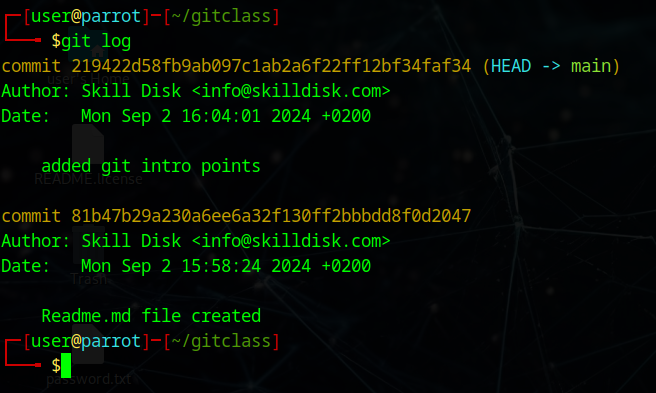

# Git Basics

1. Initialize the directory as git repository using `git init`
2. Add files to the staging area using `git add <file_names>`, file_names can be `.` to add everything in the current directory.
3. Commit the changes to track using `git commit -m 'messages'`

## Uploading to github

1. First add the remote origin
	`git remote add origin <location | url>`
2. Link the upstream and push to origin
	`git push -u origin main`
	link the current branch ( here it is main branch) in local repository to remote origin main branch

---

# Activity list

1. [File walk through](walkthrough/file_creation.md)
2. [second activiy](#)
